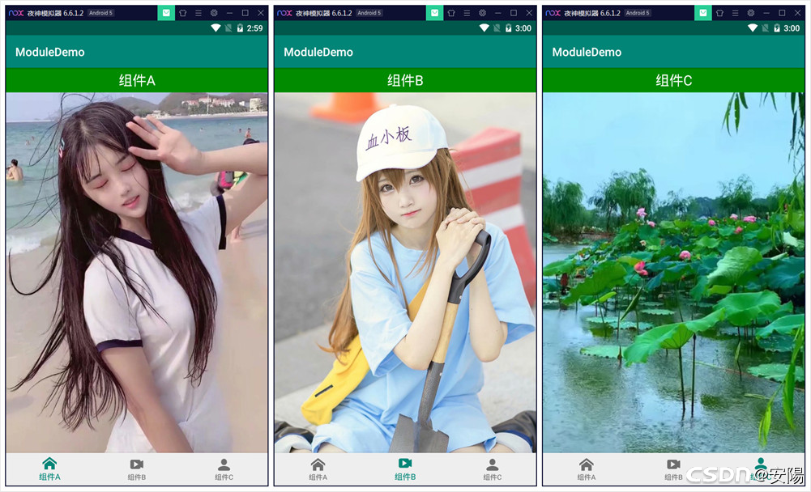

# Android组件化开发示例
### 开发语言：java
### 开发工具：Android Studio
## 项目简述：
Android组件化就是将一个app分成多个模块，每个模块都是一个组件（Module），开发的过程中我们可以让这些组件相互依赖或者单独调试部分组件等，但是最终发布的时候是将这些组件合并成一个apk，这就是组件化开发。
### 参考文章：
[文章地址](https://blog.csdn.net/qq15577969/article/details/109596071)
## APP截图：
